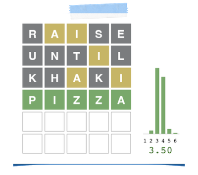

# wordle-ai (search-based AI for Wordle)

#### to run the unit tests (from root directory)

    python -m unittest

#### to compute the "best" first guess

    python agent.py data/answers.txt data/answers.txt

#### play a looping demo

    python flow.py data/answers.txt data/answers.txt 

#### play an interactive demo

    python interactive.py data/answers.txt data/answers.txt 

